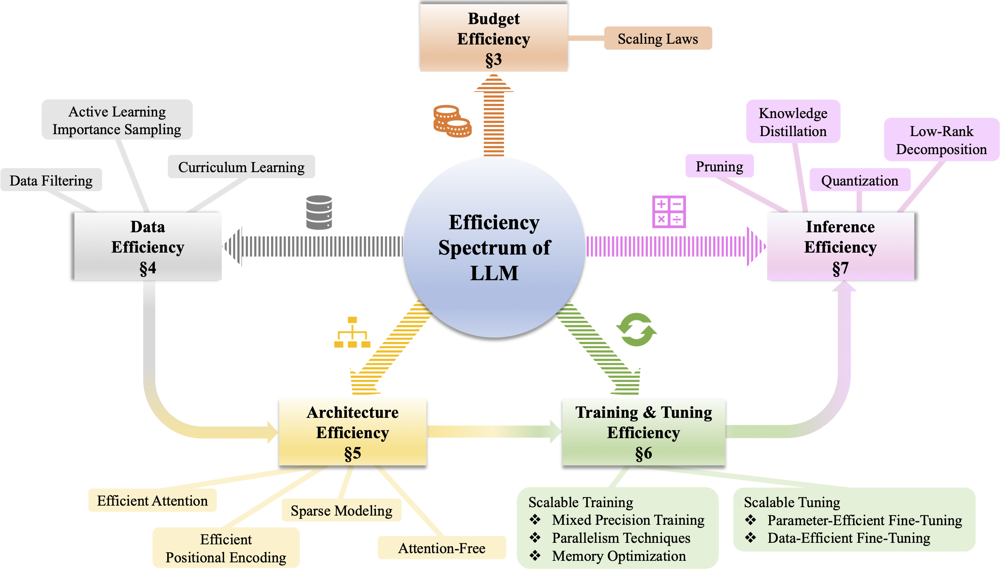

# Efficient-LLM-Survey

The rapid growth of Large Language Models (LLMs) has been a driving force in transforming various domains, reshaping the
artificial general intelligence landscape. However, the increasing computational and memory demands of these models present substantial challenges, hindering both academic research and practical applications. To address these issues, a wide array of methods, including both algorithmic and hardware solutions, have been developed to enhance the efficiency of LLMs. This survey delivers a comprehensive review of algorithmic advancements aimed at improving LLM efficiency1. Unlike other surveys that typically focus on specific areas such as training or model compression, this paper examines the multi-faceted dimensions of efficiency essential for the end-to-end algorithmic development of LLMs. Specifically, it covers various topics related to efficiency, including scaling laws, data utilization, architectural innovations, training and tuning strategies, and inference techniques. This paper aims to serve as a valuable resource for researchers and practitioners, laying the groundwork for future innovations in this critical research area. 

Paper link:  [The Efficiency Spectrum of Large Language Models: An Algorithmic Survey]()

## 💰 Budget Efficiency

## 📀 Data Efficiency

## 𝌓 Architecture Efficiency

## 📖 Training and Tuning Efficiency

## 👾 Inference Efficiency